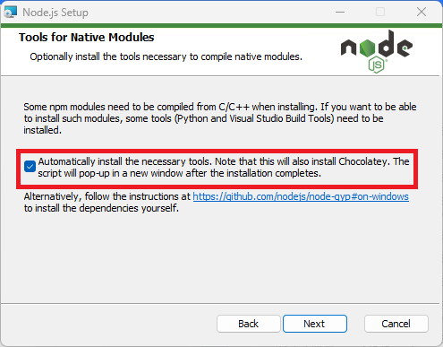

## 🛠️ Development Steps

1. To ensure a seamless setup, make sure to check the `nodejs` installation option during installation. This is a crucial first step, and here's a screenshot of the installation process:

   

2. After the installation is complete, execute the following command to install necessary dependencies:

   ```
   npm i --force
   ```

3. With your development environment set up, you can now kickstart the development process by running:

   ```
   npm run dev
   ```

# Open Source and Code Availability

It's essential to note that due to imperfect protection of intellectual property rights. While other parts of the project are open to the community, this particular aspect remains closed to external contributions.

- **Python UI Functionality**: The Python-based User Interface (UI) functionality is not open-source.

# 开源和代码可用性

需要注意的是，由于知识产权保护的不完善，并非所有的代码库都以开源格式提供。虽然项目的其他部分向社区开放，但这个特定方面对外部贡献保持关闭。

- **Python用户界面功能**: 基于Python的用户界面（UI）功能不是开源的。
